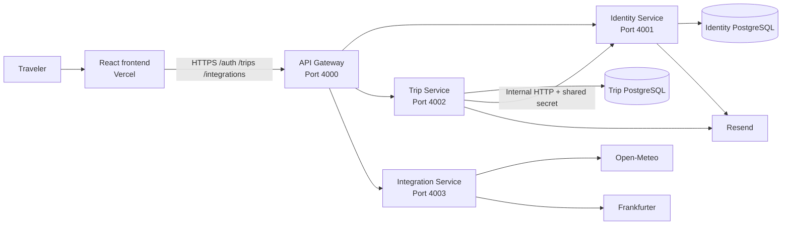
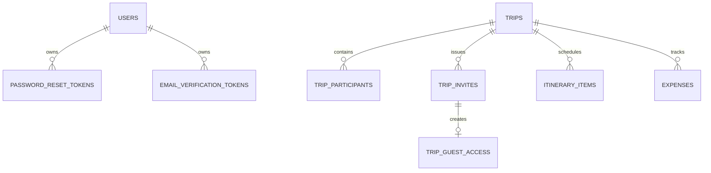
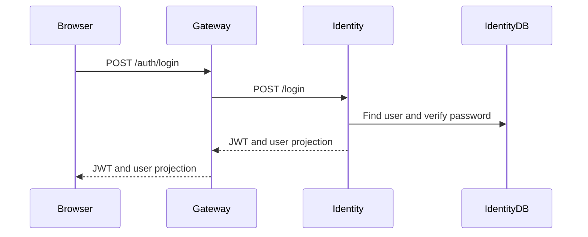

# Architecture

## 1. Purpose

TripBuddy uses a small synchronous microservice architecture. The separation is domain-driven rather than purely technical: identity data belongs to the Identity Service, travel-planning data belongs to the Trip Service, and third-party communication is isolated in the Integration Service. The Gateway gives the frontend one stable backend address.

This design keeps the diploma project understandable while demonstrating service boundaries, independent data ownership, inter-service HTTP communication, container orchestration, and production deployment.

## 2. System context

The browser never connects directly to a database or backend microservice in production. It communicates with the Gateway, which proxies requests to the correct service.

## 3. Components

### 3.1 Frontend

The frontend is a React 19 application written in TypeScript and built with Vite. It is responsible for:

- Rendering authentication, trip, invitation, guest, itinerary, expense, profile, and integration views
- Storing the JWT and current user in browser `localStorage`
- Sending authenticated requests with `Authorization: Bearer <token>`
- Client-side form validation and friendly error presentation
- English and Serbian localization through `i18next`
- Persistent light and dark themes
- Responsive desktop and mobile layouts
- Manual URL interpretation for invitations, guest links, verification links, and password-reset links

The frontend is a single-page application. Vercel rewrites all paths to `index.html`, allowing the application to interpret deep links after page refresh.

### 3.2 API Gateway

The Gateway is the only public backend process. It:

- Routes `/auth/*` to the Identity Service
- Routes `/trips/*` to the Trip Service
- Routes `/integrations/*` to the Integration Service
- Provides `GET /health`
- Restricts production CORS to `FRONTEND_URL`
- Applies Helmet security headers
- Parses JSON bodies and repairs proxied request bodies
- Applies a general limit of 300 requests per 15 minutes
- Applies a stricter limit of 20 requests per 15 minutes to sensitive authentication endpoints
- Uses structured production access logs and omits health-check noise
- Handles graceful shutdown for `SIGTERM` and `SIGINT`

### 3.3 Identity Service

The Identity Service owns accounts and authentication. Its responsibilities are:

- Registration with bcrypt password hashing
- Email verification and verification-token lifecycle
- Login and JWT creation
- Password-reset email and token lifecycle
- Authenticated profile and password updates
- Internal user lookups for the Trip Service
- Internal creation of accounts accepted through trip invitations

It owns the Identity PostgreSQL database. Other services do not query its tables directly.

### 3.4 Trip Service

The Trip Service owns the travel-planning domain:

- Trips and destination metadata
- Participant roles and authorization
- Invitation creation, preview, acceptance, and email delivery
- Read-only guest access
- Contacts established by accepted invitations
- Itinerary items
- Expenses and trip summaries
- Identity name/email resolution through internal Identity Service requests

It verifies JWTs using the same signing secret as the Identity Service. It uses the internal shared secret when calling protected Identity Service endpoints.

### 3.5 Integration Service

The Integration Service is an anti-corruption layer around third-party APIs. The frontend does not depend on provider-specific response formats.

It provides:

- Location search using Open-Meteo geocoding data
- Weather forecasts for dates supported by the forecast provider
- Historical climate estimates for later dates
- Mixed forecast/climate responses when a trip crosses the forecast boundary
- Currency conversion using Frankfurter reference rates

Provider errors are translated into stable HTTP responses before returning through the Gateway.

## 4. Request routing

| Public prefix | Gateway target | Target rewrite |
| --- | --- | --- |
| `/auth` | Identity Service | Prefix removed |
| `/trips` | Trip Service | Prefix retained |
| `/integrations` | Integration Service | Prefix removed |

Example: `GET /integrations/weather?...` becomes `GET /weather?...` inside the Integration Service.

## 5. Authentication and authorization

### 5.1 Authentication

The Identity Service signs JWTs. The frontend sends the token in the `Authorization` header. Authenticated Identity and Trip endpoints reject missing, invalid, or expired tokens.

Public endpoints intentionally exist for:

- Registration and login
- Email verification and password recovery
- Invitation preview and acceptance
- Guest-access creation and read-only guest retrieval
- Health checks

### 5.2 Trip roles

Trip authorization is expressed through three roles and three permissions.

| Role | View | Contribute | Manage |
| --- | :---: | :---: | :---: |
| `admin` | Yes | Yes | Yes |
| `user` | Yes | Yes | No |
| `guest` | Yes | No | No |

- `view`: read trip details, participants, itinerary, and expenses
- `contribute`: add itinerary items and expenses
- `manage`: edit/delete the trip, manage participants, create invitations, and delete content

The trip creator is always treated as an administrator. Unauthorized users receive `404` for hidden trips where appropriate, preventing trip-ID enumeration.

Guest links are separate from registered `guest` participants. A guest link is a hashed, time-limited credential that exposes a read-only projection of one trip.

## 6. Data ownership

Each service owns its database and schema. There are no foreign keys between the two databases.

### 6.1 Identity database

| Table | Purpose | Important constraints |
| --- | --- | --- |
| `users` | Account identity and credentials | Case-insensitive unique email; name required |
| `password_reset_tokens` | One-time password reset tokens | Hashed unique token; expiry; usage timestamp; cascades with user |
| `email_verification_tokens` | One-time verification tokens | Hashed unique token; expiry; usage timestamp; cascades with user |

Passwords are stored as bcrypt hashes in the historical `password` column. Raw verification and reset tokens are not stored.

### 6.2 Trip database

| Table | Purpose | Important constraints |
| --- | --- | --- |
| `trips` | Core trip and destination data | Trip name unique per creator, case-insensitive |
| `trip_participants` | Registered user membership | Unique trip/user pair; role check |
| `trip_invites` | Email invitations | Unique token; role check; acceptance and expiry state |
| `trip_contacts` | Reusable relationship from accepted invitations | Ordered distinct user pair; unique pair |
| `trip_guest_access` | Read-only link access | Hashed unique token; one access row per invite; expiry/revocation |
| `itinerary_items` | Scheduled plans | Trip reference stored as service-local ID |
| `expenses` | Monetary trip items | Amount, supported currency, optional category |

The Trip Service stores Identity user IDs as shared identifiers. It resolves names and emails by calling the Identity Service.

## 7. Important flows

### 7.1 Login

### 7.2 Create a trip

1. The user selects a validated location from autocomplete results.
2. The frontend submits normalized destination metadata and dates.
3. The Gateway forwards the authenticated request.
4. The Trip Service validates required fields and date order.
5. The trip is inserted and its creator is returned as the effective administrator.

### 7.3 Accept an invitation

1. An administrator creates an email invitation with a role.
2. The Trip Service stores a random invitation token and sends an email through Resend.
3. The recipient opens the public preview endpoint.
4. An existing user logs in with the invited email, or a new account is created through the Identity Service.
5. The Trip Service adds/updates the participant, accepts the invite, and stores a reusable contact relationship.

The Trip database transaction cannot include the Identity database. If account creation succeeds but a later Trip database operation fails, the account may remain while the invitation remains unaccepted. This is an explicitly handled distributed-transaction limitation.

### 7.4 Guest access

1. A recipient chooses read-only guest access from an unaccepted invitation.
2. The Trip Service creates a random guest token and stores only its SHA-256 hash.
3. The invitation becomes accepted.
4. The raw token is returned once and used in the guest URL.
5. Guest retrieval returns only trip, itinerary, expense, and access-expiry data.

### 7.5 Weather and climate

The Integration Service divides requested trip dates into provider-supported forecast dates and later dates. Later dates use historical daily climate estimates. A single response can therefore contain both `forecast` and `climate` entries, each clearly identified in the frontend.

## 8. Runtime and resilience

- Compose health checks control startup ordering.
- Production containers use `restart: unless-stopped`.
- Backend services run compiled JavaScript from `dist` in production.
- Each process validates required production environment variables at startup.
- Placeholder values such as `change_me` and `<PLACEHOLDER>` are rejected in production.
- Database schemas are idempotently ensured during service startup.
- Processes close HTTP servers and database pools during graceful shutdown.
- Request logging excludes health probes.

## 9. Deliberate boundaries

- Communication is synchronous HTTP; there is no message broker.
- Schema initialization is code-driven rather than managed by a migration framework.
- Databases run on the same production host as the backend containers.
- The frontend uses lightweight manual routing rather than React Router.
- Provider data is advisory: weather beyond the forecast window is a climate estimate, and exchange-rate totals are approximate reference values.
