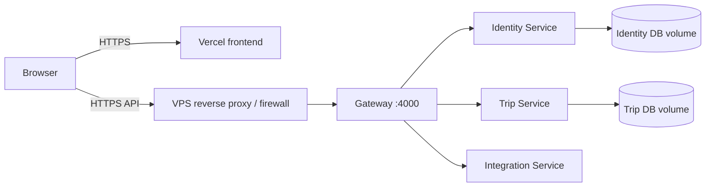

# Deployment and Operations

## 1. Production topology

TripBuddy uses two deployment targets:

- The React static build is deployed to Vercel.
- Gateway, services, and PostgreSQL databases run on a Linux VPS through `docker-compose.prod.yml`.

Only Gateway port `4000` is published by the production Compose stack. Service and database ports remain inside the Docker network.



TLS termination, DNS, firewall policy, and any reverse proxy in front of port `4000` are host infrastructure and are not defined in this repository.

## 2. Release prerequisites

Before deployment:

1. Merge the tested feature/fix branches into `develop`.
2. Complete manual desktop and mobile QA.
3. Confirm all GitHub Actions jobs are green.
4. Merge `develop` into `master`.
5. Use valid semantic versions in service `package.json` and lockfiles.
6. Create and push a tag such as `v1.3.0`.
7. Confirm the production server working tree is clean.

There is no automatic continuous deployment. Production updates are deliberate manual operations.

## 3. Production environment

On the VPS, create the untracked environment file from the template:

```bash
cp .env.production.example .env.production
```

Replace every placeholder and every `change_me` value.

| Variable | Purpose |
| --- | --- |
| `IDENTITY_DB_NAME` | Identity PostgreSQL database name |
| `IDENTITY_DB_USER` | Identity PostgreSQL user |
| `IDENTITY_DB_PASSWORD` | Identity PostgreSQL password |
| `TRIP_DB_NAME` | Trip PostgreSQL database name |
| `TRIP_DB_USER` | Trip PostgreSQL user |
| `TRIP_DB_PASSWORD` | Trip PostgreSQL password |
| `IDENTITY_JWT_SECRET` | JWT signing secret shared with Trip Service |
| `INTERNAL_SERVICE_SECRET` | Secret for Trip-to-Identity internal requests |
| `RESEND_API_KEY` | Transactional email API key |
| `EMAIL_FROM` | Verified sender address/name |
| `FRONTEND_URL` | Exact production frontend origin |

Generate independent, high-entropy values for database passwords, JWT signing, and internal service authentication. Do not reuse example values.

Production services reject missing values and unsafe literals such as `change_me` and `<PLACEHOLDER>` during startup.

Verify required values without printing secrets:

```bash
for key in IDENTITY_DB_NAME IDENTITY_DB_USER IDENTITY_DB_PASSWORD TRIP_DB_NAME TRIP_DB_USER TRIP_DB_PASSWORD IDENTITY_JWT_SECRET INTERNAL_SERVICE_SECRET RESEND_API_KEY EMAIL_FROM FRONTEND_URL; do
  grep -q "^${key}=.\+" .env.production && echo "$key: present" || echo "$key: missing or empty"
done
```

## 4. First backend deployment

Example application directory:

```bash
cd /opt/apps/TripBuddy
```

Build and start:

```bash
docker compose --env-file .env.production -f docker-compose.prod.yml up -d --build
```

Check health:

```bash
docker compose --env-file .env.production -f docker-compose.prod.yml ps
```

All six containers should be running; Gateway and all services/databases should become healthy.

Inspect startup logs:

```bash
docker compose --env-file .env.production -f docker-compose.prod.yml logs --tail=100 gateway identity-service integration-service trip-service
```

Healthy application logs include each service listening on its configured port and both database-owning services confirming connections and schema initialization.

## 5. Updating production

From a clean `master` checkout:

```bash
git status --short --branch
git pull --ff-only
docker compose --env-file .env.production -f docker-compose.prod.yml up -d --build
```

Then repeat the health and log checks from the previous section.

`up -d --build` recreates changed application containers while preserving named PostgreSQL volumes. It does not clear user data.

## 6. Frontend deployment

The Vercel project root must point to `frontend` or use equivalent build settings:

| Setting | Value |
| --- | --- |
| Framework | Vite |
| Install command | `npm ci` |
| Build command | `npm run build` |
| Output directory | `dist` |

Set:

```text
VITE_API_BASE_URL=https://<production-api-domain>
```

The value is embedded at build time. Changing it requires a new frontend deployment.

`frontend/vercel.json` rewrites every route to `index.html`, which is required for refreshed invitation, verification, password-reset, and guest URLs.

After deployment, verify:

- Login page loads over HTTPS.
- Browser requests target the production API.
- Direct deep links render rather than returning a Vercel 404.
- The API allows exactly the configured `FRONTEND_URL` origin.

## 7. Smoke test

Perform at least this sequence after each release:

1. Open the frontend in a private browser window.
2. Register and verify a new test account.
3. Log in and create a trip using destination autocomplete.
4. Open the trip and confirm weather data.
5. Add an itinerary item and expense.
6. Confirm expense conversion.
7. Create and open an invitation.
8. Test a registered invite acceptance or read-only guest flow.
9. Switch language and theme.
10. Check mobile layout.
11. Review backend logs for unexpected `4xx`/`5xx` bursts or stack traces.

## 8. Operations

### Container status

```bash
docker compose --env-file .env.production -f docker-compose.prod.yml ps
```

### Recent logs

```bash
docker compose --env-file .env.production -f docker-compose.prod.yml logs --tail=100 gateway identity-service integration-service trip-service
```

### Follow logs

```bash
docker compose --env-file .env.production -f docker-compose.prod.yml logs -f gateway identity-service integration-service trip-service
```

### Restart one service

```bash
docker compose --env-file .env.production -f docker-compose.prod.yml restart trip-service
```

### Rebuild one service

```bash
docker compose --env-file .env.production -f docker-compose.prod.yml up -d --build trip-service
```

## 9. Database data

Production data is stored in named volumes:

- `tripbuddy_identity_db_data`
- `tripbuddy_trip_db_data`

Normal `docker compose down`, container recreation, builds, and application updates preserve these volumes.

Never run either of the following during a normal deployment:

```bash
docker compose down -v
docker volume rm tripbuddy_identity_db_data tripbuddy_trip_db_data
```

Those operations permanently delete database data.

### Disposable-data reset

Only when the environment is explicitly confirmed to contain no real user data, records can be cleared without deleting volumes:

```bash
docker compose --env-file .env.production -f docker-compose.prod.yml exec -T identity-db sh -c 'psql -U "$POSTGRES_USER" -d "$POSTGRES_DB" -c "TRUNCATE TABLE email_verification_tokens, password_reset_tokens, users RESTART IDENTITY CASCADE;"'
docker compose --env-file .env.production -f docker-compose.prod.yml exec -T trip-db sh -c 'psql -U "$POSTGRES_USER" -d "$POSTGRES_DB" -c "TRUNCATE TABLE trip_guest_access, trip_contacts, trip_invites, trip_participants, itinerary_items, expenses, trips RESTART IDENTITY CASCADE;"'
```

## 10. Backup and restore

Before the application holds real user data, establish automated encrypted backups outside the VPS. A minimal manual logical backup is:

```bash
docker compose --env-file .env.production -f docker-compose.prod.yml exec -T identity-db sh -c 'pg_dump -U "$POSTGRES_USER" -d "$POSTGRES_DB"' > identity-backup.sql
docker compose --env-file .env.production -f docker-compose.prod.yml exec -T trip-db sh -c 'pg_dump -U "$POSTGRES_USER" -d "$POSTGRES_DB"' > trip-backup.sql
```

Backups contain sensitive account and trip data. Restrict permissions, encrypt them, test restoration, and define retention before treating the system as production-ready for real users.

## 11. Rollback

Application rollback is performed with Git tags:

1. Record current container status and logs.
2. Check out the previous known-good release tag on the server.
3. Rebuild the affected containers with the same `.env.production`.
4. Verify health and run the smoke test.

Because schema initialization is forward-only and there is no migration framework, inspect database changes before rolling application code backward. Never assume an older service can safely use a newer schema.

## 12. Incident checklist

1. Confirm whether the frontend, Gateway, one service, or a provider is failing.
2. Check container health and timestamps.
3. Inspect Gateway and target-service logs.
4. Verify environment presence without printing secret values.
5. Test `GET /health` locally on the VPS.
6. Check DNS, TLS, reverse proxy, firewall, Vercel, Resend, Open-Meteo, or Frankfurter status as relevant.
7. Rebuild/restart only the affected application container.
8. Roll back only after considering schema compatibility.
